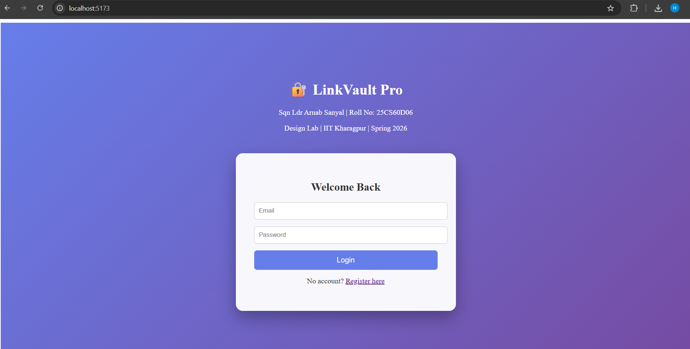
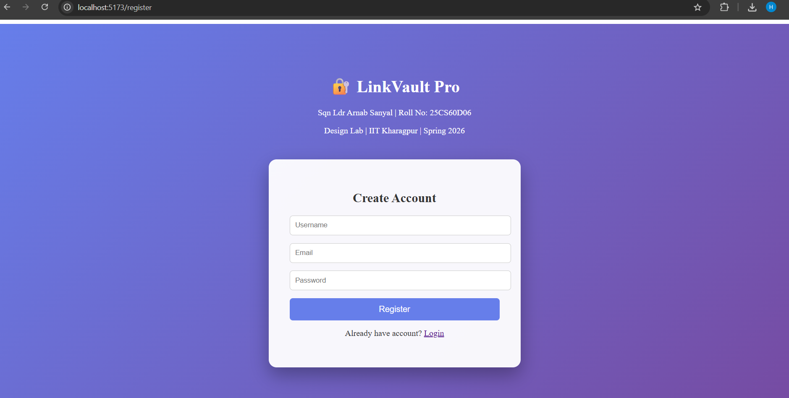
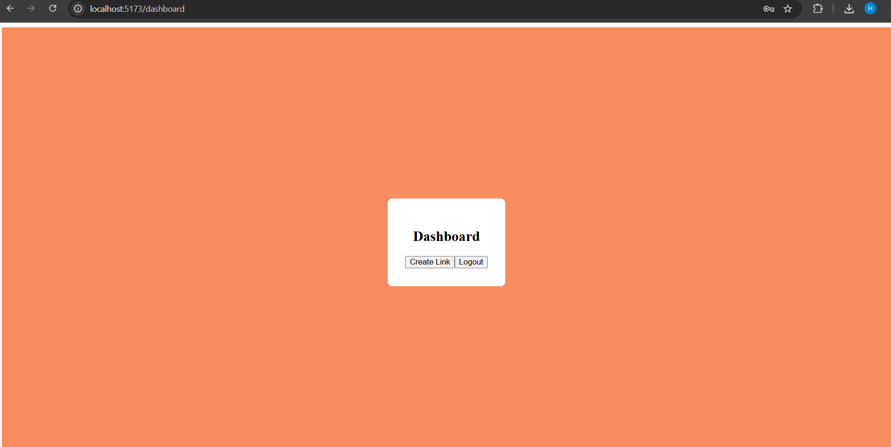
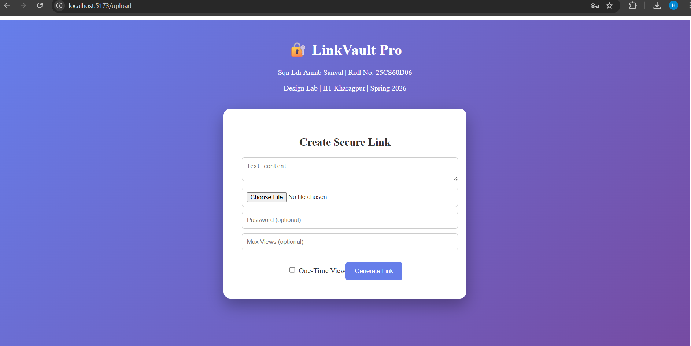
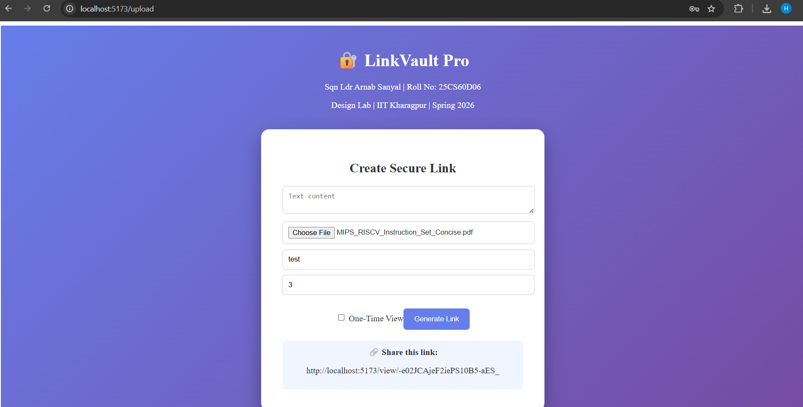
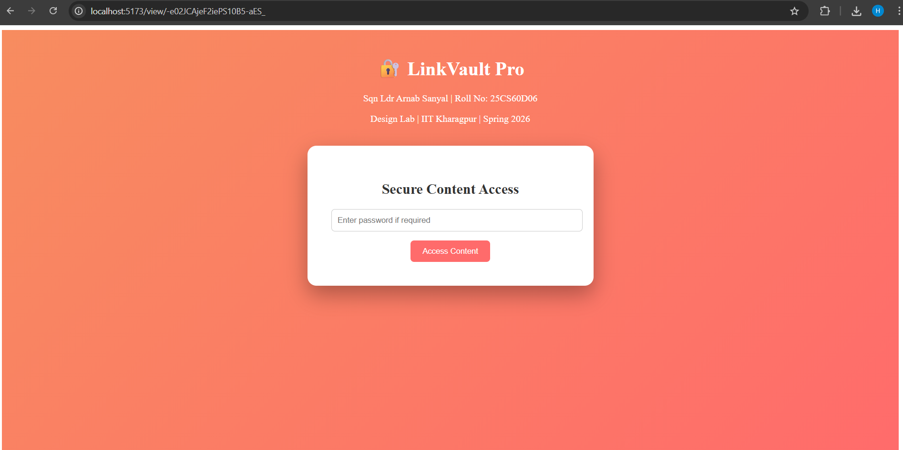
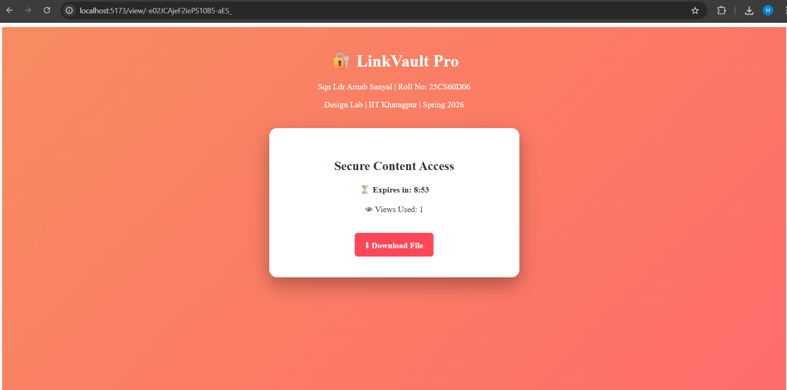

# LinkVault Pro

Secure Link-Based File & Text Sharing System

Sqn Ldr Arnab Sanyal\
Roll No: 25CS60D06\
Design Lab -- IIT Kharagpur\
Spring 2026

------------------------------------------------------------------------

## Project Overview

LinkVault Pro is a full-stack web application that allows users to
upload either text or files and generate a secure, shareable link. The
uploaded content can only be accessed using the exact generated link,
similar to systems like temporary file-sharing services.

This project was implemented as part of the Design Lab take-home
assignment. Along with the core requirements, all optional bonus
features have also been implemented.

The system supports:

-   User authentication using JWT
-   Password-protected links
-   One-time view links
-   Maximum view count limits
-   Automatic expiry
-   Background cleanup of expired links
-   Owner-based manual deletion
-   File size validation
-   Secure link generation using NanoID

------------------------------------------------------------------------

## Tech Stack

### Frontend

-   React (Vite)
-   Axios

### Backend

-   Node.js
-   Express.js
-   jsonwebtoken (JWT)
-   bcrypt (password hashing)
-   Multer (file uploads)
-   node-cron (background cleanup)

### Database

-   SQLite

------------------------------------------------------------------------

## Features Implemented

### Core Features

-   Upload plain text OR file (only one per share)
-   Unique 24-character NanoID-based link generation
-   Access restricted strictly via generated link
-   Default expiry of 10 minutes
-   Proper handling of expired links
-   No public listing or search functionality

### Bonus Features

-   Password-protected links
-   One-time view links
-   Maximum view count restriction
-   Manual delete option (only by owner)
-   Authentication and user accounts
-   File size limit (5MB)
-   Background cron job to mark expired links
-   User-based access control

------------------------------------------------------------------------

## Application Screenshots

### Login Page

### Register Page

### Dashboard

### Upload Page

### Generated Link

### Password Protected View

### Expiry Timer View

------------------------------------------------------------------------

## Setup Instructions

### Clone Repository

    git clone <your-repo-url>
    cd LinkVault_25CS60D06

### Backend Setup

    cd backend
    npm install
    node server.js

Backend runs at:

    http://localhost:5000

### Frontend Setup

    cd frontend
    npm install
    npm run dev

Frontend runs at:

    http://localhost:5173

------------------------------------------------------------------------

## API Overview

The backend exposes REST APIs for authentication and link management.

### Authentication APIs

-   POST /api/register\
    Registers a new user with username, email and password.

-   POST /api/login\
    Authenticates user credentials and returns a JWT token.

### Link Management APIs

-   POST /api/upload\
    Uploads text or file and generates a unique link.\
    Requires JWT authentication.

-   POST /api/content/:linkId\
    Accesses content using the generated link.\
    Validates expiry, password (if set), and view limits.

-   DELETE /api/delete/:linkId\
    Allows the owner of the link to delete it manually.

------------------------------------------------------------------------

## Design Decisions

Some important design decisions taken during implementation:

-   JWT was used instead of session-based authentication to keep the
    backend stateless and simple.
-   NanoID was chosen for link generation to avoid predictable or
    sequential IDs.
-   SQLite was selected for simplicity and ease of setup since this is
    an academic project.
-   A soft delete approach (using an isDeleted flag) is used instead of
    permanently deleting records. This helps manage one-time links and
    expired links safely.
-   Expiry is validated both at access time and via a background cron
    job for cleanup.
-   File uploads are stored locally for simplicity. In a production
    setup, this can be replaced with object storage.

------------------------------------------------------------------------

## Assumptions and Limitations

-   Default expiry duration is set to 10 minutes.
-   File storage is local and not cloud-based.
-   JWT secret is hardcoded for development purposes.
-   No rate limiting is implemented.
-   The system is designed for academic demonstration and not
    large-scale production deployment.

------------------------------------------------------------------------

## Conclusion

LinkVault Pro successfully implements all required and bonus features
described in the assignment. The project demonstrates full-stack
development, authentication, access control, secure file handling, and
structured API design.
